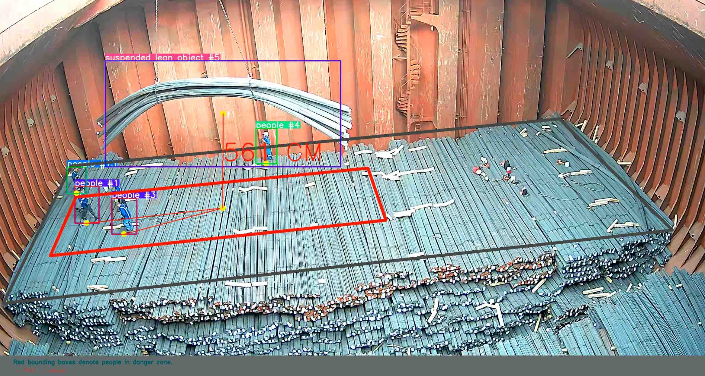
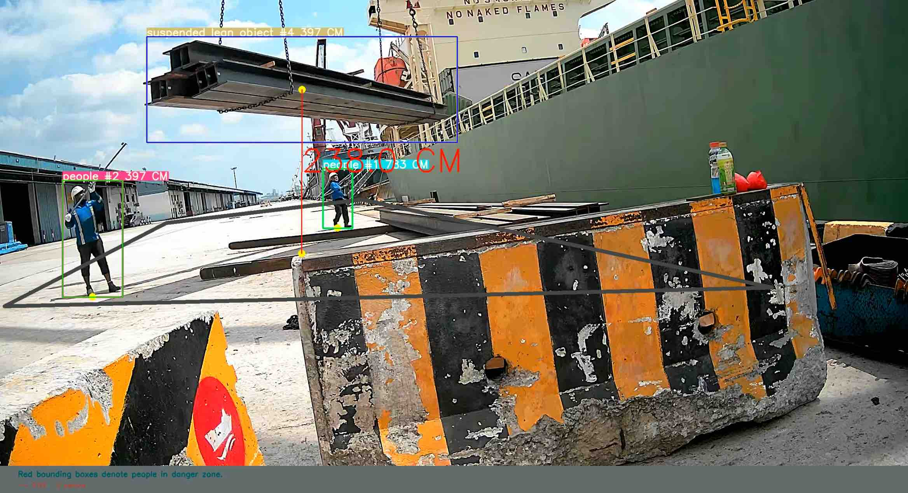
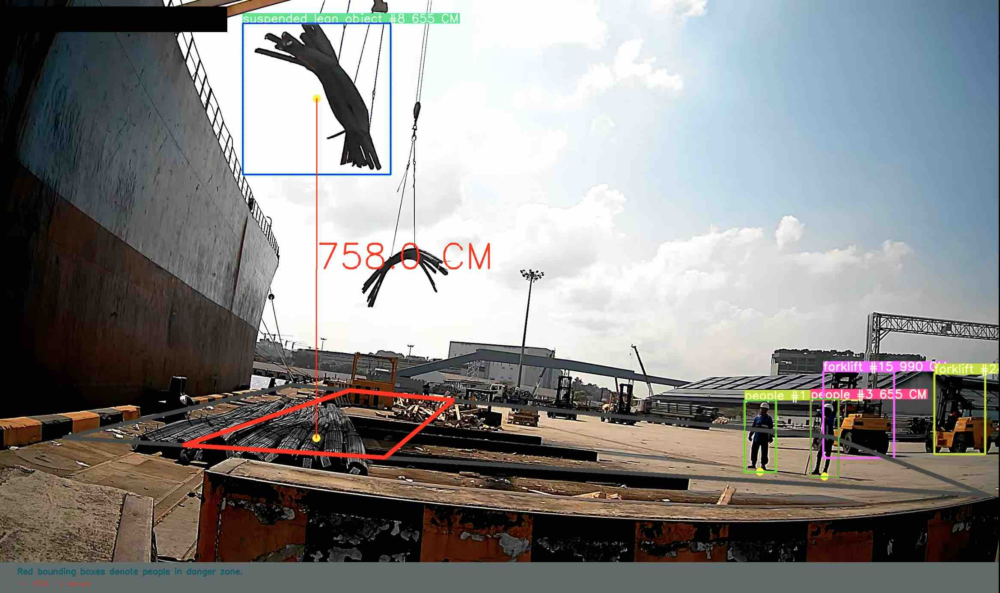
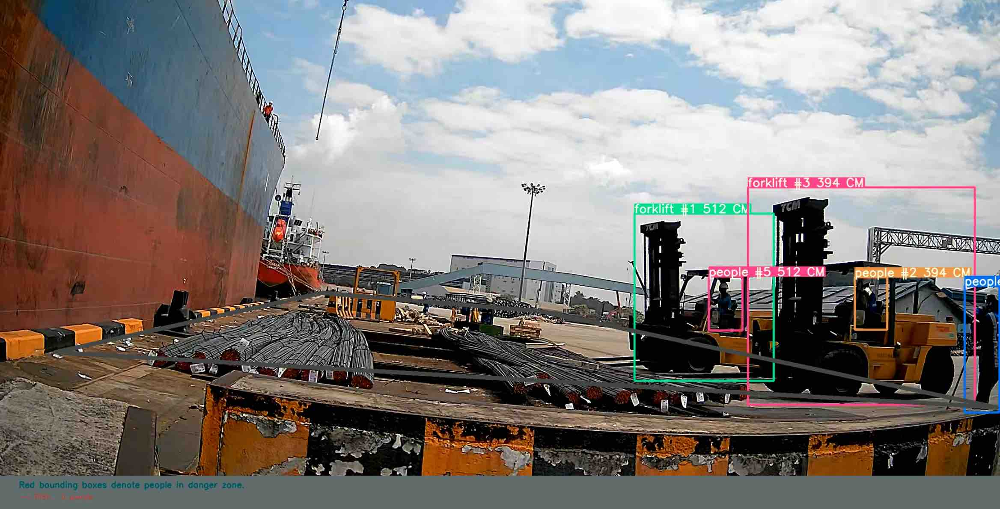

# Fall Zone Detection For Suspended Loads

  

  

  

  

Overall pipeline consists of detection, tracking and distance estimation parts. You can check some of the results from this [drive folder](https://drive.google.com/drive/folders/1ze9fHPIEsb6eC6TUAWJA2McqBIDb4ToR?usp=sharing). Unfortunetaly, the source code cannot be released due to some confidential reasons.

## Detection for Related Objects
For the detection part, [YoloV5](https://github.com/ultralytics/yolov5) model is used. Pretrained YoloV5 model is used as a starting point and [Icevision](https://github.com/airctic/icevision) framework is used for fine-tuning purposes. 

## Tracking for Related Objects
We are using [zero shot CLIP based object tracking](https://github.com/roboflow-ai/zero-shot-object-tracking) for object tracking part of the pipeline. It uses deep sort with CLIP model as descriptor model. Using CLIP is useful because we don’t need to finetune it for our dataset in contrast to most of the descriptors used with deep sort algorithms.

## Distance Estimation
### Reference Area
For distance estimation, we first need to define a reference area which basically denotes the ground. For this reference area, 4 points are given by users starting from the left bottom point and going counter clockwise. This reference area is used for bird’s eye view transformation. In this documentation, “transformed” is used for bird’s eye view transformations.

### Human Height Reference
Distance estimation is performed based on human height reference. We keep average human height in pixels by using transformed people bounding boxes in the frames. We keep a running average with the window size of 10. Which means that for 10 consecutive frames, we calculate the average human height in pixels, and keep it as a running average throughout the 10 frames and we do not calculate anything for the next 20 frames. After that, we calculate this average from scratch for the next 10 frames and this loop goes like that. In that way, we find the average human height in pixels in the transformed space for y axis (since it is height). We use the same measurement for the x axis without loss of generality. We consider these measurements in the x and y axis as 170 cm in real life. We make our calculation based on these references. 
### If There is No People
If there are no people in frames while we are calculating average human height in 10 consecutive frames, we do not take any action. If we detect any people in the next frames, the pipeline gets back to the normal phase. 

### Preprocessing
First of all, if we have human carrier or forklift detection, we change their labels to suspended lean object if their bottom y coordinate is above the suspended threshold. After that we convert labels of nested forklift bounding boxes to “nested object”. Then we calculate distance estimations of the detected objects from the camera. We have constant coefficients for each object class. We divide these coefficients with the height of bounding boxes to find its distance from the camera. After these estimations, if a human is inside a human carrier or forklift, we set the distance of the human to the distance of this object (human carrier or forklift). Finally we apply a distance filter where if the object has a higher distance than a specified threshold, we mark it as “far object” and basically ignore it. These thresholds are set as 11 meter for each class. After that point, we do not draw a bounding box for “far object” and “nested object”. Also, if we have any ignored class (most probably the chain) specified with the argument, we do not draw it as well.  

### Projecting Center Point to the Ground for Suspended Lean Objects
We project the center point to the point with the same x coordinates where its y coordinate is the middle of the bottom edge of the reference area and center point. 

### Height Calculation
We calculate the distance between the transformed center point and transformed projected point by using reference measurements.

### Danger Zone Coordinates
After finding the projection point, we find danger zone coordinates in the bird's eye view. First of all, diagonal length is calculated so that it is 600 meters (this constant is specified). After finding the diagonal length, we find width and height so that their ratio is the same for width and height ratio of the bounding box. For wharf scenes, we clip the width with the specified threshold if it is larger than this threshold.

### Detecting People in Danger Area 
Based on these danger zones, it is checked whether the bottom points of people bounding boxes are inside any danger zone. If it is so, this human and suspended lean object pair is kept and drawn with a red line between bottom point of the human and projection point of the suspended lean object. Based on these checks, we draw danger zones and people in these zones.

Arguments
–budget: How many minutes we want to perform the pipeline.
–wharf: It should be specified if the video is from a wharf scene.
–angle: It should be specified if the video is from the wharf. Angle of the camera.
–no_nested: If it is specified, nested forklift detections are discarded.
–distance_check: If it is specified, distance from camera check is performed.
–ignored classes: List of ignored classes. ex: —ignored_classes chain 
–danger_zone_width_threshold: Upper threshold for danger zone widths. Only valid for wharf videos.
–danger_zone_height_threshold: Minimum threshold for height for drawing this object as a suspended lean object. 
